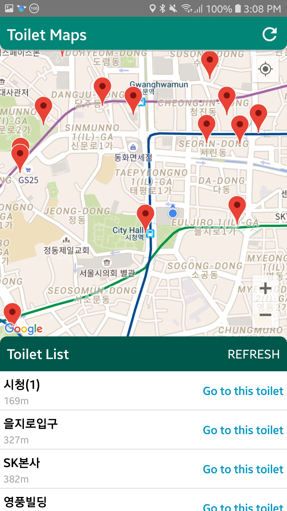
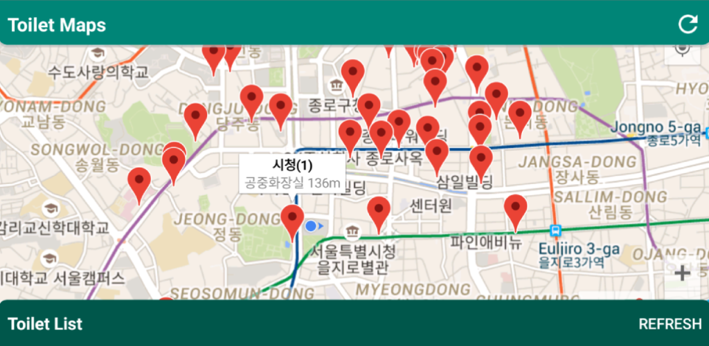
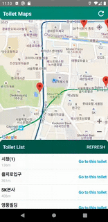
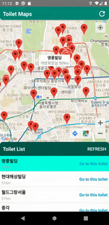
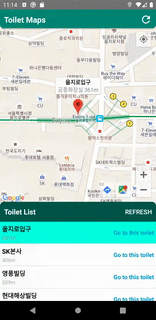
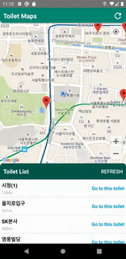
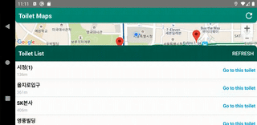

# ToiletInKorea
This application shows the list of toilets in Korea.
The data was from OpenAPI Portal in Korea.
https://www.data.go.kr/

The data was generated into SQLite file.
Toilet markers show in this application.

 

Once you click the item of list, users can see the location of the toilet in the maps.
Otherwise, once you click the markers in the map, the target item in the list is selected.

 

When you touch the "Go to the toilet" or "Route Button" in the map, google maps pop up and show the route.

The list could be gone.

 
